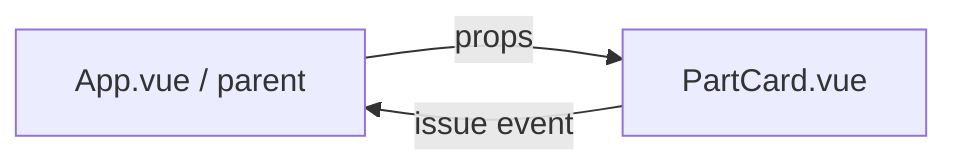
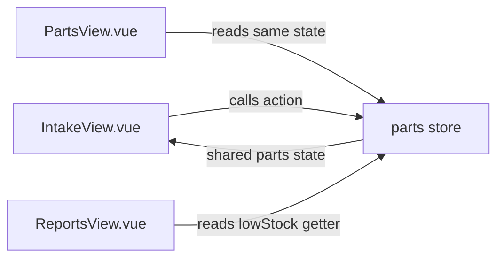

# THEORY.md — OAS Bay

## Question 1 — Reactivity

### a. Why does the counter not update?
A plain `let count = 0` is not reactive. Vue does not track ordinary JavaScript variables, so changing `count` does not tell Vue that the template needs to render again.

### b. Correct Composition API version
```js
import { ref } from 'vue'

const count = ref(0)

function increment() {
  count.value++
}
```

In the template, Vue unwraps the ref, so `{{ count }}` displays the current value.

### c. `ref()` vs `reactive()`
`ref()` is best for a single value such as `jobsStore.loading` or the active role in `src/stores/user.js`. `reactive()` is better for the complete job-card record in `src/views/IntakeView.vue`, where several related fields belong to one object.


## Question 2 — Props vs Pinia

### a. Props + emit data flow



The parent owns the data and passes `id`, `name`, `unitPrice`, and `qtyInStock` into `PartCard.vue`. The child emits `issue` when the user clicks **Issue to Job**.

# b. Pinia data flow



The store becomes the shared owner of the parts array, loading state, request error, issue action, and `lowStock` getter.

# c. When props are still useful
Props are still appropriate for a reusable child component. `src/components/PartCard.vue` should receive the part details through props because the component only needs to display one part and emit an action; it does not need to know how the application's shared parts state is stored.


## Question 3 — Business Logic

# a. Engine oil validation
The computed validation rule in `src/components/JobCardForm.vue` is:

```js
engineOilPrice: (value) => Number(value) >= 79000 && Number(value) <= 200000
```

# b. Where it is used
The rule contributes to the computed `errors` object, which contributes to `errorCount` and `isFormValid`. The submit function checks `isFormValid` before emitting the completed job, so an engine oil price outside the allowed range keeps the submit button disabled and prevents submission.

# c. Should validation also exist on the backend?
Yes. Frontend validation gives the technician immediate feedback, but the backend must re-check business rules because browser validation can be bypassed. The Day 9 course material describes the backend as the authority for saved job data.

---

# Question 4 — Routing & Guards

# a. Link hiding vs `beforeEach`
The `v-if` checks in `src/App.vue` are a user-experience convenience: they hide links that the active role cannot use. The `beforeEach` guard in `src/router/index.js` is the route-access control because it still runs when someone types a protected URL directly.

# b. Guard example
```js
router.beforeEach((to) => {
  const user = useUserStore()
  if (to.meta.roles && !to.meta.roles.includes(user.role)) {
    return { name: 'bays' }
  }
  return true
})
```

This prevents an unauthorized role from opening protected routes such as `/parts` or `/reports`.

### c. What happens if the link is hidden but the guard is missing?
A technician could still type `/reports` or `/parts` into the browser address bar and reach the route. Hiding the link alone does not protect the route.

---

## Question 5 — Lifecycle & Async

 a. `onMounted()`
`onMounted()` runs after the component has been mounted into the DOM. In `src/views/PartsView.vue`, it starts `store.fetchParts` when the page opens. Calling a DOM-dependent lifecycle operation at the top level of `<script setup>` would happen before the component has completed mounting.

# b. Why `await` matters
`fetch()` returns a Promise. Without `await`, `const data = fetch('/api/parts')` makes `data` the Promise rather than the JSON response. The store therefore awaits the request and then reads the response data.

# c. Three request states
The parts store models `loading`, `error`, and `parts` data. `PartsView.vue` shows a loading message while `loading` is true, an error message and retry button when `error` exists, and the catalogue when the request succeeds.
